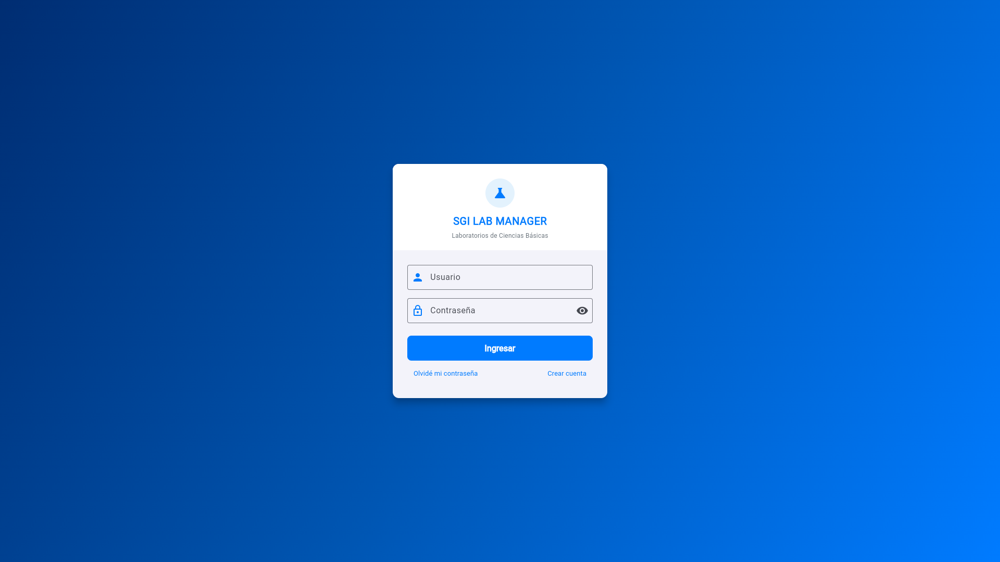
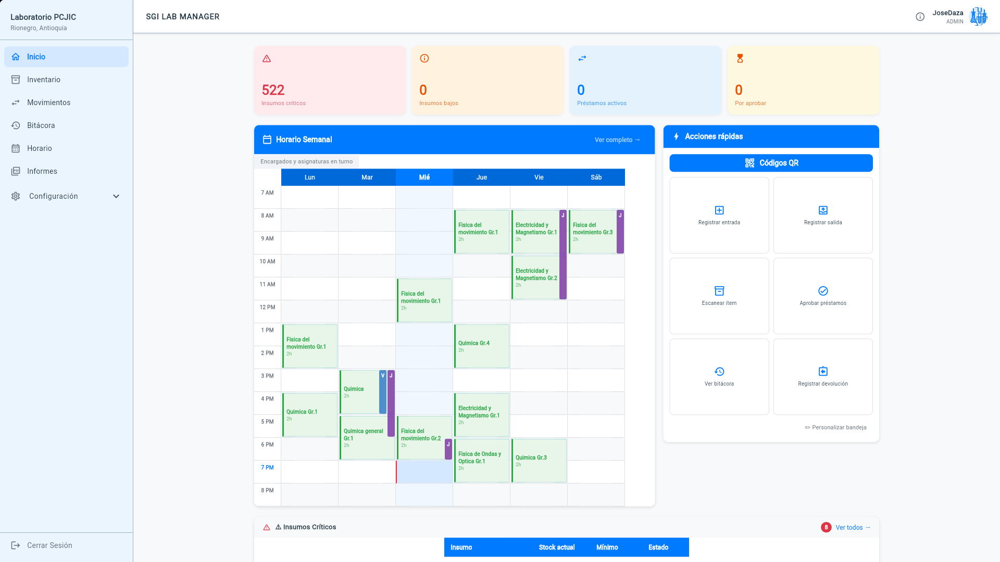
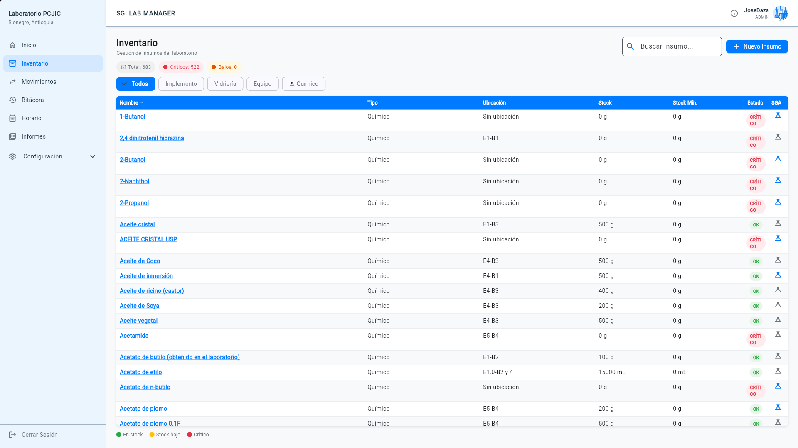
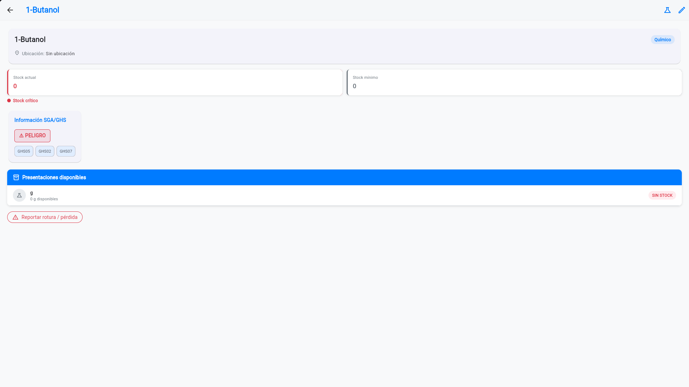
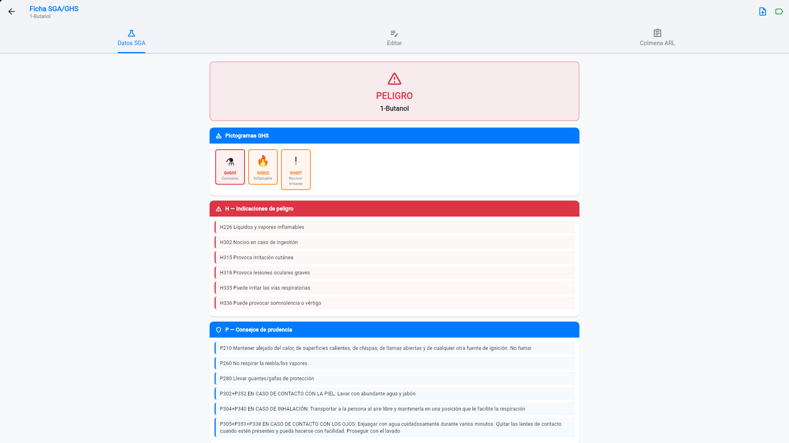
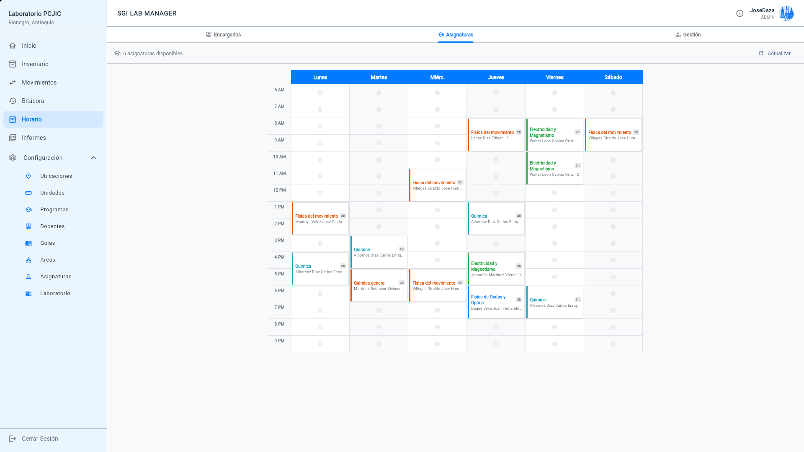
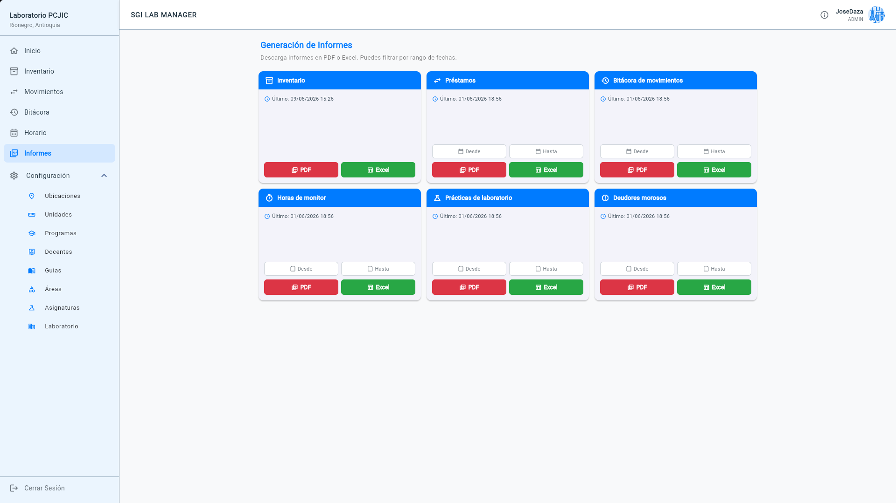
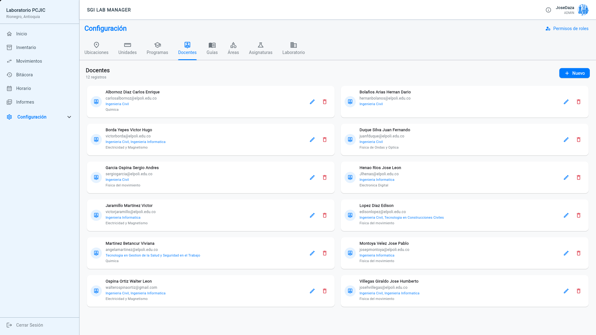
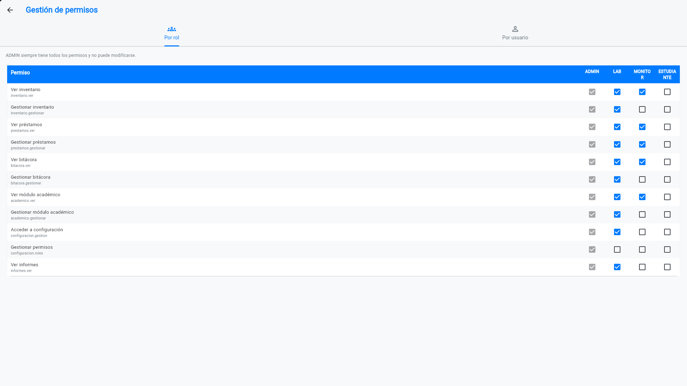
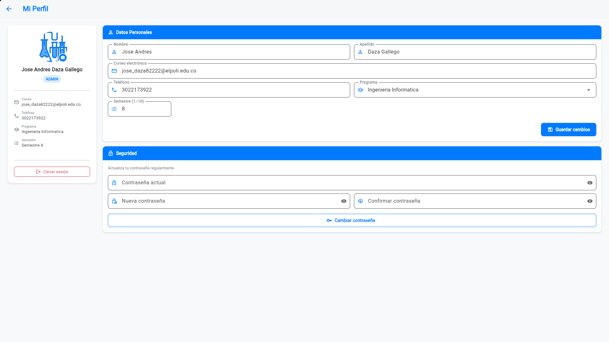

# SGI LAB MANAGER — Frontend

Aplicación multiplataforma (Android · Web · Linux) para la gestión del **Laboratorio Integrado** del Politécnico Colombiano Jaime Isaza Cadavid (PCJIC), Rionegro, Colombia.

Desarrollada en **Flutter/Dart** con arquitectura Provider, sincronización offline y soporte completo de seguridad química SGA/GHS.

[](LICENSE)
[](https://flutter.dev)
[](https://github.com/FoxyYTs/SGI_LAB_MANAGER_BACKEND)

---

## Capturas de pantalla

<table>
  <tr>
    <td align="center"><b>Login</b></td>
    <td align="center"><b>Dashboard</b></td>
  </tr>
  <tr>
    <td></td>
    <td></td>
  </tr>
  <tr>
    <td align="center"><b>Inventario</b></td>
    <td align="center"><b>Detalle de insumo</b></td>
  </tr>
  <tr>
    <td></td>
    <td></td>
  </tr>
  <tr>
    <td align="center"><b>Ficha SGA/GHS</b></td>
    <td align="center"><b>Horario semanal — Asignaturas</b></td>
  </tr>
  <tr>
    <td></td>
    <td></td>
  </tr>
  <tr>
    <td align="center"><b>Informes PDF/Excel</b></td>
    <td align="center"><b>Configuración — Docentes</b></td>
  </tr>
  <tr>
    <td></td>
    <td></td>
  </tr>
  <tr>
    <td align="center"><b>Gestión de permisos</b></td>
    <td align="center"><b>Mi Perfil</b></td>
  </tr>
  <tr>
    <td></td>
    <td></td>
  </tr>
</table>

---

## Stack tecnológico

| Tecnología | Uso |
|---|---|
| Flutter 3.x / Dart | Framework multiplataforma (Android, Web, Linux) |
| Provider | Gestión de estado global |
| Dio | Cliente HTTP con interceptor JWT y auto-refresh |
| flutter_secure_storage | Almacenamiento seguro de tokens (AES-GCM en web, keyring en Linux) |
| sqflite / sqflite_common_ffi | Base de datos SQLite local (caché y cola offline) |
| connectivity_plus | Detección de red para sincronización offline |
| workmanager | Tareas en background para Android (notificaciones de stock) |
| flutter_local_notifications | Notificaciones nativas Android |
| qr_flutter | Generación de códigos QR |
| file_picker | Selección de archivos (PDFs de FDS, fotos de perfil) |
| url_launcher | Apertura de enlaces externos (FDS en Drive, guías) |

---

## Módulos

| Módulo | Descripción |
|---|---|
| **Inventario** | Control de insumos (Implementos, Vidriería, Químicos, Equipos) con semáforo de stock y múltiples presentaciones por insumo |
| **SGA/GHS** | Ficha de seguridad química: pictogramas GHS, frases H/P, NFPA 704, extracción automática de FDS con IA (Groq/Llama), generación de etiqueta PDF |
| **Préstamos** | Flujo PENDIENTE → ACTIVO → DEVUELTO con descuento de stock y formulario público por QR |
| **Bitácora** | Historial de movimientos (ENTRADA, SALIDA, AJUSTE, ROTURA, CONSUMO_PRÁCTICA) |
| **Horario** | Cuadrícula semanal Lun–Sáb × 6–21h para encargados y asignaturas con franjas de color |
| **Informes** | 6 tipos de PDF/Excel con filtros por fecha (inventario, préstamos, horas monitor, prácticas, deudores) |
| **Configuración** | Ubicaciones, unidades, programas, docentes, guías, áreas, asignaturas, laboratorio |
| **Permisos** | Gestión granular por rol (ADMIN, LAB, MONITOR, ESTUDIANTE) y por usuario individual |
| **Mi Perfil** | Edición de datos personales, foto de perfil y cambio de contraseña |

---

## Características técnicas destacadas

- **Offline-first**: cola SQLite sincroniza acciones cuando vuelve la red. Login bloqueado sin conexión.
- **JWT con refresco transparente**: interceptor Dio renueva el token y reintenta la petición sin interrumpir al usuario. Lifetime 2h.
- **Soporte multiplataforma**: stubs condicionales para sqflite y connectivity en Web (sin romper la build).
- **Notificaciones Android**: Workmanager dispara alertas de stock crítico, fin de turno de monitor y cambio de estado del servidor.
- **Formularios QR públicos**: solicitud de préstamo, registro de horas monitor y reporte de rotura — sin necesidad de login.
- **Layout adaptativo**: sidebar fijo en desktop/tablet, drawer en móvil, detección de landscape en teléfono.

---

## Demo en producción

| Entorno | URL |
|---|---|
| Web (producción) | [sgilabmanager.foxyyts.qzz.io](https://sgilabmanager.foxyyts.qzz.io) |
| API | [apisgi.foxyyts.qzz.io](https://apisgi.foxyyts.qzz.io) |

Infraestructura: Docker Compose · Gunicorn · Nginx · Cloudflare Zero Trust Tunnel.

---

## Instalación y desarrollo

```bash
# Clonar
git clone https://github.com/FoxyYTs/SGI_LAB_MANAGER_FRONTEND.git
cd SGI_LAB_MANAGER_FRONTEND/frontend

# Instalar dependencias
flutter pub get

# Ejecutar en Linux (desarrollo — requiere backend corriendo en localhost:8000)
flutter run -d linux --dart-define=SERVER_URL=http://localhost:8000

# Build web para producción
flutter build web --dart-define=SERVER_URL=https://apisgi.foxyyts.qzz.io --release

# Build Android (release)
flutter build apk --release --dart-define=SERVER_URL=https://apisgi.foxyyts.qzz.io

# APK de diagnóstico (logs a archivo + detalles técnicos en UI)
flutter build apk --release \
  --dart-define=DEV_MODE=true \
  --dart-define=SERVER_URL=https://apisgi.foxyyts.qzz.io
```

Requiere el [backend](https://github.com/FoxyYTs/SGI_LAB_MANAGER_BACKEND) corriendo.

---

## Tests de integración

Suite de **22 tests end-to-end** que corren la app real en Linux contra el servidor de desarrollo (`dev-apisgi.foxyyts.qzz.io`). Cubren login, inventario, préstamos, bitácora y SGA.

```bash
flutter test integration_test/run_all_test.dart \
  --dart-define=SERVER_URL=https://dev-apisgi.foxyyts.qzz.io \
  --dart-define=TEST_USER=TuUsuario \
  --dart-define=TEST_PASSWORD=TuClave \
  -d linux
```

| Módulo | Tests | Qué verifica |
| --- | --- | --- |
| Login | 3 | Campos visibles, credenciales inválidas, login exitoso → sidebar |
| Inventario | 4 | Carga de lista, filtro por tipo, chips críticos/bajos, apertura de detalle |
| Préstamos | 4 | Lista carga, formulario abre, validación vacío, registro completo |
| Bitácora | 5 | Carga, chips de filtro, filtrar Entrada, filtrar Salida, tiene movimientos |
| SGA | 6 | Botón en tabla, 3 pestañas, Datos SGA, Editar, Colmena ARL, diálogo etiqueta GHS |

Los archivos están en `frontend/integration_test/`. Las credenciales se pasan por `--dart-define` y nunca se guardan en el código.

---

## Licencia

GNU Affero General Public License v3.0 — ver [LICENSE](LICENSE).

Desarrollado por [FoxyYTs](https://foxyyts.qzz.io) · 2025–2026
